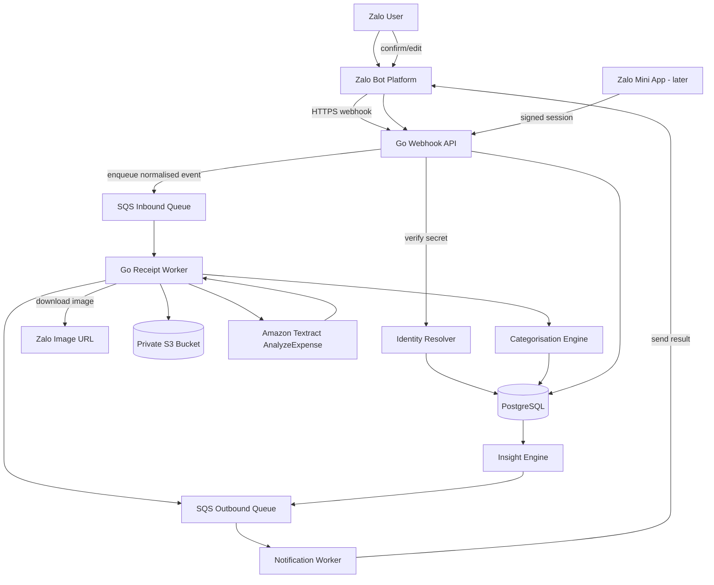

# Zalo Expense Tracker — Agent-Orchestrated Execution Plan

**Status:** Execution-ready  
**Plan version:** 1.2  
**Prepared:** 2026-07-19  
**Last updated:** 2026-08-12  
**Primary channel:** Zalo Bot  
**Primary backend:** Go  
**Secondary learning implementation:** Rust worker after the Go MVP  
**Data store:** PostgreSQL  
**Cloud:** AWS  
**Initial audience:** A controlled pilot of relatives and trusted users  

---

## Current delivery goal — real Zalo + Gemini Flash OCR verification

**Goal date:** 2026-08-12  
**Status:** complete  

Turn the supplied real credentials into a safe, repeatable proof that the
actual Zalo Bot and Gemini vision path works end to end, while preserving the
local-only test ladder and producing evidence suitable for later pilot scale.

Acceptance criteria:

1. The ignored `.env` selects the current official Zalo API host,
   `EXTRACTOR=gemini`, and the current stable multimodal Flash model without
   exposing token/key values in output or errors.
2. The Zalo adapter accepts the current `ok/result` event envelope, string
   `photo` field, the live polling API's `photo_url` field, and millisecond
   timestamp while retaining legacy payload compatibility; polling uses the
   documented POST method.
3. `make provider-check` validates the token through read-only `getMe` and
   proves real OCR against a generated PNG with known fields—no user message,
   personal image or database mutation required.
4. `make e2e-real` resets only a dedicated local database and its fixed object
   directory, validates the effective pgx target against query overrides,
   discovers a sender through a random challenge without replying, pins pilot
   access to that sender, starts the normal three-process stack, and cleans up
   all children.
5. The E2E monitor proves onboarding, real image intake/download, Gemini
   provenance, required extracted fields, a valid draft, successful review
   card delivery, user confirmation and successful acknowledgement, with no
   dead job or failed/ambiguous outbound.
6. Attempt lifecycle rows transition from `started` to terminal state so
   operational evidence is accurate; unit and integration tests cover every
   provider compatibility and monitoring fix.
7. An independent `$review-agent` pass reviews the complete goal diff and
   surrounding code for defects and scale risks; actionable findings are
   reconciled or explicitly documented.
8. README, runbook and this plan explain the credential setup, privacy boundary,
   repeatable commands, production-webhook distinction and verification
   evidence.

This is tracked as **P4-F02** and checkpoint **CP-8**.

Completion evidence: the supplied Zalo token passes the official `getMe`
endpoint; `gemini-3.6-flash` reads the exact known merchant, total, currency and
date from the generated PNG; and the supervised phone run passed real Zalo
ingress, `photo_url` media download, Gemini extraction/provenance, review-card
delivery, user confirmation and confirmation delivery. The isolated database
contains one confirmed receipt and transaction, one successful configured-model
attempt, all three required extracted fields, zero failed/ambiguous outbounds
and zero dead jobs. Unit, integration, race, vet/lint, build, shell and a final
live provider preflight pass. The independent review's findings were reconciled
and its final pass reports no findings.

---

## Completed delivery goal — visible settings and a local feedback loop

**Goal date:** 2026-08-12  
**Status:** complete  

Make every existing user preference discoverable and usable inside the chat,
then provide a repeatable local environment in which the complete bot flow can
be tested without a Zalo account or cloud credentials.

Acceptance criteria:

1. `/caidat` shows timezone, default currency, locale and scheduled-summary
   status in one response and is discoverable from onboarding and help.
2. A user can safely change timezone with an IANA name and default currency
   with a three-letter ISO code; invalid values do not mutate data.
3. A timezone change recalculates all enabled scheduled-summary deliveries.
4. The default currency is actually used for symbol-less manual entries while
   explicit symbols continue to win.
5. `make playground` starts a loopback-only browser chat backed by PostgreSQL,
   the real handler and queue consumers, an isolated playground database,
   local object storage and mock OCR.
6. The playground exposes settings and the receipt fixture corpus, performs no
   Zalo/cloud calls, is responsive and keyboard accessible, and preserves
   production fail-closed configuration.
7. Unit and integration tests cover parsing, validation, persistence,
   rescheduling and manual-currency behaviour; README and runbook describe the
   exact local workflow.

This is tracked as **P4-F01** and checkpoint **CP-7**.

Completion evidence: unit, integration and race suites pass; the deterministic
10-step simulation passes; formatting, vet and full build pass; and desktop +
mobile browser smoke verifies onboarding, `/caidat`, persisted preference
changes, default-currency manual entry and fixture receipt processing with no
console or failed-network errors.

---

## 1. Executive decision

Build a receipt-first personal expense tracker in which a user sends a receipt or transaction screenshot to a Zalo Bot. The backend authenticates the sender through the Zalo-issued sender ID, queues the image for processing, extracts transaction information, suggests a transaction type and category, asks the user to confirm or correct the result, and stores the confirmed transaction in PostgreSQL.

The first usable product will be conversational. A Zalo Mini App is added after the transaction and insight APIs are stable.

### MVP experience

```text
User sends receipt image
        ↓
Zalo webhook
        ↓
Webhook verification and user resolution
        ↓
Receipt queued
        ↓
Image downloaded and stored privately
        ↓
OCR / expense extraction
        ↓
Merchant and category prediction
        ↓
Bot sends confirmation card
        ↓
User confirms or corrects
        ↓
Transaction becomes part of daily, weekly and monthly insights
```

### Product principle

The system is a **confidence-scored financial assistant**, not an autonomous bookkeeper.

- Never silently accept an uncertain total, date, currency, refund or transfer.
- Calculations come from PostgreSQL and deterministic application logic.
- An LLM may phrase an insight, but it must not calculate or invent the underlying numbers.
- User corrections are first-class data and become personal categorisation rules.
- Until bank import exists, the product must refer to **recorded spending**, not total spending.

---

## 2. Verified external assumptions

Provider integration surfaces were rechecked against official documentation
on 2026-08-12; commercial plan/pricing notes date from 2026-07-19. Revalidate
both before production release because APIs, limits, models and prices change.

### Zalo Bot

Current Zalo Bot Basic plan:

- Free
- Up to 3 bots
- Up to 50 users per bot
- Up to 3,000 messages per month
- Up to 3 group chats, currently Beta
- Pro is listed at 129,000 VND/month but marked as not yet available

Zalo Bot supports:

- Bot creation through Zalo Bot Manager
- Long polling for local development
- HTTPS webhooks for deployed environments
- `X-Bot-Api-Secret-Token` webhook verification
- `message.text.received`
- `message.image.received`
- Stable sender, chat and message identifiers
- An image URL in image-message webhook payloads
- `https://bot-api.zaloplatforms.com` as the documented Bot API host
- POST for `getMe`, `getUpdates` and `sendMessage`
- A current event envelope of `{ok,result:{event_name,message}}`, a string
  `photo` URL and millisecond `date` timestamps
- Mutual exclusion between local `getUpdates` polling and a configured webhook

**Planning implication:** The free Basic plan is sufficient for a relatives-only pilot. Implement an internal usage counter and warn at 70%, 85% and 95% of the monthly message allowance.

### Gemini Flash vision

The current Google AI documentation lists `gemini-3.6-flash` as a stable,
multimodal Flash model. Image input supports PNG/JPEG/WEBP/HEIC/HEIF, including
inline bytes for requests below the documented aggregate limit, and structured
JSON output is intended for extraction workloads.

**Planning implication:** use `gemini-3.6-flash` as a versioned adapter default,
retain deterministic money/date parsing and mandatory human confirmation, and
probe the configured model before a real run. Only synthetic/redacted images
may be sent through unpaid service access: Google's current terms warn that
unpaid content may be used for product improvement and human review. Use a
billing-enabled project and explicit user consent before real family receipts.

### AWS account

New AWS customers can receive:

- USD 100 in credits at account creation
- Up to an additional USD 100 through eligible activities
- Credits usable for a limited period under current Free Tier rules

AWS Free Plan accounts are for evaluation and should not process sensitive data.

**Decision:** Use an AWS **Paid Plan with credits and hard budgets** before processing real receipts. Synthetic or redacted fixtures may be used locally or under an evaluation-only account.

### Amazon Textract

Current introductory allowance for new AWS customers:

- `AnalyzeExpense`: 100 pages per month
- Duration: first three months

The published US West example price outside that allowance is USD 0.01 per page. Actual pricing depends on region.

**Planning implication:** Add a database-enforced monthly OCR quota and a kill switch. Do not rely only on AWS billing alerts.

---

## 3. Scope

## 3.1 MVP scope

The MVP must support:

- Zalo Bot onboarding and consent
- Authentication through Zalo sender identity
- Private one-to-one chats only
- Receipt image intake
- Transaction screenshot intake where extraction is possible
- Image validation
- Private object storage
- Asynchronous processing through SQS
- OCR and receipt field extraction
- Merchant normalisation
- Expense, refund and transfer suggestions
- Category suggestions
- Per-field confidence
- Bot-based confirmation and correction
- Manual transaction entry through chat
- Transaction history commands
- Daily, weekly and monthly recorded-spending summaries
- User-specific merchant-to-category rules
- Duplicate detection
- Data export
- Account and receipt-image deletion
- Cost and quota controls
- Auditability of predictions and corrections
- Discoverable user settings for timezone, default currency and summaries
- A no-cloud browser playground for local conversation and fixture testing

## 3.2 Explicitly deferred

Do not include these in the first MVP:

- Open banking
- Direct bank credentials
- Tax advice
- Investment tracking
- Credit scoring
- Shared household ledgers
- Multi-currency conversion gains or losses
- Full accounting double-entry
- Automated financial recommendations
- Psychological profiling
- Voice input
- Group-chat expense splitting
- Custom-trained neural models
- Microservices
- Kafka
- Kubernetes
- A vector database
- A public multi-tenant SaaS launch
- Simultaneous Go and Rust production implementations

---

## 4. Success criteria

The first pilot is successful when all of the following are true:

1. A permitted Zalo user can send a receipt image and receive a suggested transaction.
2. The webhook returns successfully without waiting for OCR.
3. Duplicate webhook delivery does not create duplicate expenses.
4. The system extracts merchant, total, date and currency from the validation set with measurable accuracy.
5. Every extracted field has a source and confidence.
6. A user can confirm or correct a suggestion entirely inside Zalo.
7. A correction updates the final transaction and records the prediction error.
8. Repeated transactions from the same merchant begin using the user’s preferred category.
9. Daily, weekly and monthly summaries reconcile exactly with stored confirmed transactions.
10. A user can delete their receipt image and account data.
11. The deployment has cost alarms, service quotas and a tested shutdown switch.
12. At least five relatives can use the system for two weeks without developer intervention for normal flows.
13. A user can inspect and change every supported preference inside Zalo.
14. A developer can exercise onboarding, settings, manual entry, receipt
    extraction and confirmation locally with one command and no provider key.

### Initial quantitative targets

| Metric | MVP target |
|---|---:|
| Total amount exact accuracy on clean receipts | ≥ 95% |
| Currency accuracy | ≥ 98% |
| Transaction date exact accuracy | ≥ 90% |
| Merchant normalisation accuracy | ≥ 85% |
| Top-1 category accuracy after five corrections | ≥ 85% for repeated merchants |
| Dangerous silent error rate | 0% |
| Duplicate transaction rate from webhook retries | 0% |
| P95 webhook acknowledgement | < 500 ms, excluding network |
| P95 receipt processing | < 20 seconds under pilot load |
| Confirm-without-edit rate after learning period | ≥ 70% |
| Unexplained insight discrepancies | 0 |

A dangerous error is one of:

- Wrong total accepted automatically
- Wrong currency accepted automatically
- Refund treated as expense without confirmation
- Transfer treated as spending without confirmation
- Another user’s transaction exposed
- Duplicate webhook creating a second confirmed transaction

---

## 5. Architecture



## 5.1 Initial deployment topology

### Local development

```text
Docker Compose
├── PostgreSQL
├── Three-process mode: Go API + receipt worker + notification worker
└── Playground mode: one loopback Go process
    ├── Browser chat and visible settings
    ├── PostgreSQL-backed queue consumers
    ├── Local filesystem object adapter
    └── Embedded mock extraction corpus
```

### AWS pilot

Default pilot topology:

```text
One EC2 instance
├── Caddy
├── Go API
├── Go receipt worker
├── Go notification worker
└── PostgreSQL container

Managed AWS services
├── S3
├── SQS + dead-letter queues
├── Textract
├── CloudWatch
├── Systems Manager Parameter Store
├── AWS Budgets
└── daily encrypted PostgreSQL backup in S3
```

This topology minimises recurring cost and supports the concurrency-learning objective.

### Migration trigger to RDS

Move PostgreSQL to RDS when any of the following becomes true:

- The system is opened beyond a trusted pilot.
- Availability expectations exceed a personal project.
- Database restoration becomes operationally burdensome.
- The EC2 host is being scaled or frequently replaced.
- More than one application host is required.
- The projected RDS cost is accepted.

Do not represent the single-host pilot as highly available.

---

## 6. Technology decisions

## 6.1 Backend

- Go current stable release
- `net/http`
- A lightweight router such as `chi`
- `pgx`
- `sqlc`
- PostgreSQL migrations with `golang-migrate`, Goose or Atlas
- AWS SDK for Go v2
- Structured logging with `slog` or Zap
- OpenTelemetry instrumentation after the vertical slice
- `pprof` enabled only on an internal or protected listener
- `go test -race` in CI
- Docker for repeatable development and deployment

## 6.2 Rust learning track

Rust is not on the MVP critical path.

After the Go worker is stable, implement a Rust receipt worker using:

- Tokio
- AWS SDK for Rust
- SQLx
- Serde
- Tracing
- Semaphore-bounded concurrency
- Graceful cancellation
- The same queue contract and database integration tests as Go

The Rust implementation must not change the message schema to make its implementation easier.

## 6.3 PostgreSQL

Use:

- UUID primary keys
- `BIGINT` minor-unit amounts
- ISO 4217 currency codes
- UTC timestamps
- User timezone as a separate preference
- Check constraints for state machines
- Unique constraints for idempotency
- Row ownership checks in every repository
- Row-level security later as defence in depth
- JSONB only for raw provider payloads, model evidence and versioned extraction snapshots

Do not store money in floating-point fields.

## 6.4 Infrastructure as code

Use Terraform.

Terraform owns:

- S3 buckets
- SQS queues and dead-letter queues
- IAM roles and policies
- Security groups
- EC2 instance and storage
- CloudWatch log groups and alarms
- Budget notifications where supported
- Parameter Store entries or references
- DNS records after a domain exists

Never place Zalo bot tokens, webhook secrets or database passwords in Terraform source or state as plaintext variables.

---

## 7. Repository structure

```text
zalo-expense-tracker/
├── AGENTS.md
├── README.md
├── Makefile
├── go.mod
├── go.sum
├── .golangci.yml
├── .github/
│   └── workflows/
│       ├── ci.yml
│       ├── terraform-plan.yml
│       └── security.yml
├── cmd/
│   ├── api/
│   │   └── main.go
│   ├── receipt-worker/
│   │   └── main.go
│   ├── notification-worker/
│   │   └── main.go
│   └── migrate/
│       └── main.go
├── internal/
│   ├── identity/
│   ├── messaging/
│   │   ├── provider.go
│   │   └── zalo/
│   ├── receipt/
│   ├── extraction/
│   │   ├── extractor.go
│   │   ├── mock/
│   │   └── textract/
│   ├── transaction/
│   ├── merchant/
│   ├── categorisation/
│   ├── insight/
│   ├── quota/
│   ├── audit/
│   └── platform/
│       ├── postgres/
│       ├── objectstore/
│       ├── queue/
│       └── clock/
├── contracts/
│   ├── events/
│   ├── api/
│   └── fixtures/
├── db/
│   ├── migrations/
│   ├── queries/
│   └── seeds/
├── deploy/
│   ├── docker/
│   └── terraform/
├── miniapp/
│   └── README.md
├── rust-worker/
│   └── README.md
├── test/
│   ├── integration/
│   ├── contract/
│   ├── load/
│   └── receipts/
└── docs/
    ├── adr/
    ├── threat-model.md
    ├── runbook.md
    ├── privacy-data-map.md
    └── evaluation.md
```

---

## 8. Domain model

## 8.1 Core tables

### `users`

```text
id
status
timezone
default_currency
locale
consent_version
consented_at
created_at
updated_at
deleted_at
```

### `user_identities`

```text
id
user_id
provider
provider_subject
provider_scope
created_at
last_seen_at
```

Constraint:

```text
UNIQUE(provider, provider_subject, provider_scope)
```

For Zalo:

```text
provider         = zalo_bot
provider_subject = message.from.id
provider_scope   = bot_id
```

### `provider_messages`

```text
id
provider
provider_chat_id
provider_message_id
user_id
event_type
payload_hash
raw_payload_json
received_at
processed_at
status
```

Constraint:

```text
UNIQUE(provider, provider_chat_id, provider_message_id)
```

### `receipt_documents`

```text
id
user_id
provider_message_id
storage_key
source_url_hash
content_type
byte_size
sha256
perceptual_hash
status
retention_policy
delete_after
created_at
updated_at
deleted_at
```

### `receipt_processing_attempts`

```text
receipt_id
processor_name
processor_version
attempt_number
status
started_at
completed_at
error_class
error_code
```

Constraint:

```text
UNIQUE(receipt_id, processor_name, processor_version, attempt_number)
```

### `transactions`

```text
id
user_id
receipt_document_id
account_id
type
merchant_id
description
amount_minor
currency
occurred_at
category_id
status
source
confidence_summary
confirmed_at
version
created_at
updated_at
deleted_at
```

### `extracted_fields`

```text
id
receipt_document_id
field_name
raw_value
normalised_value
confidence
source
evidence_json
extractor_name
extractor_version
created_at
```

### `predictions`

```text
id
transaction_id
prediction_type
predicted_value
confidence
model_name
model_version
feature_snapshot_json
created_at
```

### `corrections`

```text
id
transaction_id
field_name
predicted_value
corrected_value
source
created_at
```

### `merchants`

```text
id
canonical_name
normalised_name
merchant_family
created_at
```

### `merchant_aliases`

```text
id
merchant_id
alias
normalised_alias
source
```

### `user_merchant_rules`

```text
user_id
merchant_id
preferred_category_id
preferred_transaction_type
preferred_tags_json
sample_count
confidence
last_confirmed_at
```

### `categories`

```text
id
system_key
display_name
parent_id
is_system
created_at
```

### `insights`

```text
id
user_id
insight_type
period_start
period_end
payload_json
evidence_json
generator_version
status
created_at
dismissed_at
```

### `usage_counters`

```text
scope
scope_id
period
metric
count
limit_value
updated_at
```

Use this for:

- Zalo messages sent and received
- Textract pages
- Images downloaded
- OCR failures
- Per-user processing caps

---

## 9. State machines

## 9.1 Receipt state

```text
received
→ queued
→ downloading
→ stored
→ extracting
→ review_required
→ confirmed
→ deleted
```

Failure branches:

```text
downloading → failed_transient | failed_permanent
extracting  → failed_transient | failed_permanent
```

Allowed retry:

```text
failed_transient → queued
```

A database constraint or domain validation must reject illegal transitions.

## 9.2 Transaction state

```text
draft
→ awaiting_confirmation
→ confirmed
→ amended
→ deleted
```

Insights use only confirmed and amended transactions that are not deleted.

---

## 10. Internal contracts

Contracts are owned by the **Contract Agent** and approved by the orchestrator before implementation agents begin integration.

## 10.1 Normalised inbound event

```go
type InboundEvent struct {
    Provider          string
    ProviderUserID    string
    ProviderChatID    string
    ProviderMessageID string
    EventType         string
    Text              string
    Media             []MediaReference
    ReceivedAt        time.Time
    RawPayloadHash    string
}
```

## 10.2 Media reference

```go
type MediaReference struct {
    Provider string
    URL      string
    MimeType string
    Caption  string
}
```

Do not place the full image bytes in SQS.

## 10.3 Receipt-processing job

```json
{
  "schema_version": 1,
  "job_id": "uuid",
  "receipt_id": "uuid",
  "user_id": "uuid",
  "provider": "zalo_bot",
  "provider_chat_id": "string",
  "provider_message_id": "string",
  "attempt": 1,
  "enqueued_at": "RFC3339"
}
```

## 10.4 Extraction result

```json
{
  "schema_version": 1,
  "extractor": {
    "name": "textract-analyze-expense",
    "version": "v1"
  },
  "fields": {
    "merchant": {
      "raw": "CTY TNHH ABC",
      "normalised": "ABC",
      "confidence": 0.92
    },
    "total_minor": {
      "raw": "150.000",
      "normalised": 150000,
      "confidence": 0.98
    },
    "currency": {
      "raw": "VND",
      "normalised": "VND",
      "confidence": 0.95
    },
    "occurred_at": {
      "raw": "18/07/2026 12:31",
      "normalised": "2026-07-18T05:31:00Z",
      "confidence": 0.90
    }
  },
  "line_items": [],
  "warnings": []
}
```

## 10.5 Messaging provider interface

```go
type MessagingProvider interface {
    VerifyWebhook(ctx context.Context, headers http.Header, body []byte) error
    ParseWebhook(ctx context.Context, body []byte) ([]InboundEvent, error)
    Send(ctx context.Context, message OutboundMessage) (ProviderMessageRef, error)
    DownloadMedia(ctx context.Context, ref MediaReference) (io.ReadCloser, MediaMetadata, error)
}
```

No domain package may import Zalo SDK types.

---

## 11. Conversation design

## 11.1 First contact

```text
Xin chào! Tôi giúp ghi nhận và tổng hợp các khoản chi từ ảnh hóa đơn.

Dữ liệu có thể bao gồm thông tin mua hàng và được lưu để tạo báo cáo chi tiêu.
Bạn có thể xóa dữ liệu bất kỳ lúc nào.

[Đồng ý và bắt đầu]
[Xem cách dữ liệu được sử dụng]
```

The user is not created as active until consent is recorded.

## 11.2 Successful extraction

```text
Tôi đọc được:

Cửa hàng: Co.opmart
Số tiền: 325.000 ₫
Ngày: 19/07/2026
Loại: Chi tiêu
Danh mục: Thực phẩm

[✅ Xác nhận]
[✏️ Chỉnh sửa]
[🗑 Bỏ qua]
```

## 11.3 Low-confidence extraction

```text
Tôi chưa chắc về tổng tiền.

Cửa hàng: Co.opmart
Số tiền: 325.000 ₫  ⚠️
Ngày: 19/07/2026
Danh mục: Thực phẩm

[Đúng]
[Sửa số tiền]
[Xem ảnh]
```

## 11.4 Unsupported image

```text
Tôi chưa nhận ra đây là hóa đơn hoặc ảnh giao dịch.

Bạn có thể:
• gửi ảnh rõ hơn;
• cắt bớt phần không liên quan; hoặc
• nhập: "150000 ăn trưa".
```

## 11.5 Commands

```text
/batdau
/homnay
/tuan
/thang
/ganday
/ngansach
/caidat
/tongket
/xuatdulieu
/xoadulieu
/trogiup
```

Also support natural phrases such as:

```text
Hôm nay tôi tiêu bao nhiêu?
Tháng này ăn uống hết bao nhiêu?
Đổi khoản gần nhất sang đi lại.
150000 ăn trưa.
```

---

## 12. Security and privacy baseline

The pilot processes sensitive personal financial information. Security tasks are release blockers.

### Required controls

- Verify `X-Bot-Api-Secret-Token` using constant-time comparison.
- Accept webhook requests only over HTTPS.
- Limit webhook body size.
- Validate JSON strictly.
- Deduplicate provider messages.
- Never trust display names as identity.
- Restrict pilot access through an allowlist.
- Encrypt storage volumes and S3 objects.
- Use an S3 bucket with all public access blocked.
- Use least-privilege IAM.
- Rotate Zalo Bot token and webhook secret.
- Keep secrets outside Git.
- Redact receipt content from logs.
- Do not log raw webhook payloads in production unless encrypted and retention-limited.
- Use signed or private object access.
- Apply image retention policy.
- Strip metadata where appropriate.
- Implement data export and deletion.
- Separate production and development data.
- Back up PostgreSQL daily.
- Test restoration before pilot.
- Add account-level and per-user rate limits.
- Add an emergency OCR kill switch.
- Add an emergency outbound-message kill switch.
- Add a privacy data map and threat model.
- Record all administrative data access.

### Default receipt retention

```text
Unprocessed uploads: 1 day
Processed originals: 30 days
Extraction metadata: retained until user deletion
Deleted-account backup retention: documented and minimised
```

Allow users to choose immediate deletion of originals after extraction.

---

## 13. Cost controls

## 13.1 Hard controls

Implement these before enabling Textract:

- `TEXTRACT_ENABLED=false` by default
- `MONTHLY_TEXTRACT_PAGE_LIMIT=80` during trial
- Per-user daily receipt limit
- Duplicate image hash check before OCR
- Maximum file size
- Supported MIME allowlist
- Maximum image dimensions after preprocessing
- SQS maximum receive count
- Dead-letter queue
- Zalo monthly message counter
- Outbound-message suppression after quota threshold
- AWS Budget alerts
- CloudWatch alarms
- S3 lifecycle deletion
- EC2 idle shutdown procedure
- One-region policy

## 13.2 Pilot budget model

Treat this as a planning estimate, not a quote:

```text
Zalo Bot Basic:          0 VND under current pilot limits
Textract first 3 months: up to 100 AnalyzeExpense pages/month introductory allowance
Textract after trial:    region-dependent; official US West example is USD 0.01/page
S3 and SQS:              low at family scale
EC2/PostgreSQL:          main persistent infrastructure cost after credits
```

Every monthly review must compare:

- Forecast
- Actual AWS bill
- Zalo message count
- Textract page count
- Receipts per active user
- Cost per confirmed transaction

---

## 14. Agent operating model

## 14.1 Agent roles

### O — Orchestrator

Owns:

- Dependency graph
- Task assignment
- Contract approval
- Merge order
- Integration gates
- Architectural decisions
- Scope control
- Release decision

The orchestrator should avoid implementing feature code unless resolving a cross-agent conflict.

### C — Contract and Domain Agent

Owns:

- Domain terminology
- Event schemas
- API contracts
- Database state machines
- Category taxonomy
- Money and date rules
- ADRs affecting multiple workstreams

### B — Backend Core Agent

Owns:

- Go service skeleton
- HTTP middleware
- Configuration
- Database access
- Transactions
- Identity resolution
- Error model
- Graceful shutdown

### Z — Zalo Integration Agent

Owns:

- Webhook verification
- Webhook parsing
- Zalo messaging adapter
- Image-message handling
- Long-polling development utility
- Callback and command parsing
- Zalo usage counters

### R — Receipt Pipeline Agent

Owns:

- Media download
- S3 storage
- SQS worker
- Extraction interface
- Textract adapter
- Normalisation
- Confidence
- Duplicate detection
- Retry policy

### I — Insights Agent

Owns:

- Daily, weekly and monthly SQL
- Evidence records
- Recurring-merchant detection
- Budget calculations later
- Summary message generation

### P — Platform Agent

Owns:

- Docker
- Terraform
- AWS resources
- CI/CD
- Secrets
- Logging
- Backups
- Budgets and alarms
- Deployment runbook

### Q — Quality and Security Agent

Owns:

- Test strategy
- Receipt fixture set
- Contract tests
- Threat model
- Abuse cases
- Load tests
- Race tests
- Restoration drill
- Release verification

### M — Mini App Agent

Starts only after the transaction API stabilises.

Owns:

- Zalo Mini App shell
- Signed identity/session validation
- Dashboard
- Transaction history and editing
- Budget screens
- Data deletion UI

### X — Rust Experiment Agent

Starts only after the Go worker reaches the specified stability gate.

Owns:

- Rust worker
- Contract parity
- Benchmarks
- Operational comparison
- Recommendation on whether Rust should remain

---

## 14.2 Rules for agent collaboration

1. An agent may modify only its assigned ownership paths unless the orchestrator approves.
2. Shared contracts are changed only through a contract pull request.
3. No agent may bypass a failing contract test.
4. Every task must produce code, tests, documentation or an explicit research decision.
5. Every pull request must state:
   - task ID;
   - files changed;
   - contract impact;
   - tests run;
   - known limitations;
   - migration or deployment impact.
6. Agents must not add infrastructure services without an ADR.
7. Agents must not introduce an LLM where deterministic logic is sufficient.
8. Agents must not expose raw provider payloads outside adapter packages.
9. Agents must preserve backward compatibility within a phase unless the orchestrator schedules a coordinated contract migration.
10. The orchestrator merges shared contracts before dependent implementations.
11. Integration branches are short-lived.
12. Feature branches are rebased after contract changes, not patched independently with incompatible copies.

---

## 14.3 Branch naming

```text
agent/<agent-code>/<task-id>-short-description
```

Examples:

```text
agent/c/F0-03-event-contracts
agent/z/P1-04-zalo-webhook
agent/r/P2-03-textract-adapter
```

Commit format:

```text
<task-id>: imperative summary
```

Pull request title:

```text
[<task-id>][<agent-code>] Summary
```

---

## 14.4 Shared-file ownership

| Path | Primary owner |
|---|---|
| `contracts/**` | C |
| `db/migrations/**` | C with B review |
| `internal/messaging/zalo/**` | Z |
| `internal/receipt/**` | R |
| `internal/extraction/**` | R |
| `internal/insight/**` | I |
| `deploy/**` | P |
| `test/receipts/**` | Q |
| `docs/threat-model.md` | Q |
| `miniapp/**` | M |
| `rust-worker/**` | X |
| `cmd/**` | B with relevant agent review |

---

## 15. Dependency graph

```mermaid
flowchart LR
    F0[Phase 0: Decisions and contracts]
    F1A[1A Go foundation]
    F1B[1B Zalo spike]
    F1C[1C Infra foundation]
    F1D[1D Receipt fixtures]
    F1E[1E Conversation design]

    G1{Gate 1: contracts + local foundations}

    F2A[2A Webhook + identity]
    F2B[2B Queue + fake extraction]
    F2C[2C Transaction persistence]
    F2D[2D Outbound messaging]

    G2{Gate 2: fake end-to-end vertical slice}

    F3A[3A S3 media pipeline]
    F3B[3B Textract adapter]
    F3C[3C Normalisation + confidence]
    F3D[3D Confirmation + correction]
    F3E[3E Cost and quota enforcement]

    G3{Gate 3: real receipt loop}

    F4A[4A Personal merchant learning]
    F4B[4B Daily/weekly/monthly insights]
    F4C[4C Duplicate detection]
    F4D[4D Export and deletion]
    F4E[4E Mini App shell]

    G4{Gate 4: family pilot candidate}

    F5A[5A Security hardening]
    F5B[5B Load and failure testing]
    F5C[5C AWS deployment]
    F5D[5D Pilot onboarding]

    G5{Gate 5: pilot live}

    F6A[6A Rust worker]
    F6B[6B CSV import]
    F6C[6C Forecasting]
    F6D[6D RDS migration evaluation]

    F0 --> F1A
    F0 --> F1B
    F0 --> F1C
    F0 --> F1D
    F0 --> F1E

    F1A --> G1
    F1B --> G1
    F1C --> G1
    F1D --> G1
    F1E --> G1

    G1 --> F2A
    G1 --> F2B
    G1 --> F2C
    G1 --> F2D

    F2A --> G2
    F2B --> G2
    F2C --> G2
    F2D --> G2

    G2 --> F3A
    G2 --> F3B
    G2 --> F3C
    G2 --> F3D
    G2 --> F3E

    F3A --> G3
    F3B --> G3
    F3C --> G3
    F3D --> G3
    F3E --> G3

    G3 --> F4A
    G3 --> F4B
    G3 --> F4C
    G3 --> F4D
    G3 --> F4E

    F4A --> G4
    F4B --> G4
    F4C --> G4
    F4D --> G4

    G4 --> F5A
    G4 --> F5B
    G4 --> F5C
    G4 --> F5D

    F5A --> G5
    F5B --> G5
    F5C --> G5
    F5D --> G5

    G5 --> F6A
    G5 --> F6B
    G5 --> F6C
    G5 --> F6D
```



---

## 16. Parallel execution matrix

Legend:

- **P** — may run in parallel
- **S** — must be sequenced
- **G** — integration gate

| Phase | Workstreams | Parallel? | Blocking output |
|---|---|---:|---|
| 0 | Product decisions, contracts, taxonomy, privacy rules | Limited | Approved baseline |
| 1 | Go foundation, Zalo spike, Terraform skeleton, fixtures, conversation UX | P | Gate 1 |
| 2 | Webhook, fake worker, DB transaction model, outbound adapter | P after contracts | Gate 2 |
| 3 | S3, Textract, normalisation, correction flow, quotas | P with mocks | Gate 3 |
| 4 | Learning rules, insights, duplicate detection, export/deletion, Mini App shell | P | Gate 4 |
| 5 | Security, load tests, deployment, pilot docs | P with coordinated fixes | Gate 5 |
| 6 | Rust worker, CSV import, forecasting, RDS evaluation | P | Independent decisions |

### Highest-value parallelisation

The following bundles are intentionally safe to run simultaneously:

```text
Bundle A
├── Backend service skeleton
├── Zalo API spike
├── Terraform skeleton
├── Receipt evaluation fixtures
└── Conversation copy

Bundle B
├── Webhook and identity
├── Fake receipt worker
├── Transaction persistence
└── Outbound message rendering

Bundle C
├── S3 storage
├── Textract adapter against fixtures
├── Normalisation library
├── Confirmation state machine
└── Quota enforcement

Bundle D
├── Merchant learning
├── Insight SQL
├── Duplicate detection
├── Export/deletion
└── Mini App shell
```

---

## 17. Work breakdown

# Phase 0 — Freeze the execution baseline

**Goal:** Remove ambiguity before agents produce incompatible implementations.

### F0-01 — Product scope and terminology

**Owner:** O + C  
**Deliverables:**

- `docs/product-scope.md`
- Transaction type definitions
- “Recorded spending” wording rule
- MVP and deferred-feature lists
- Initial category taxonomy

**Acceptance:**

- Expense, income, refund, transfer and adjustment are unambiguous.
- Categories and tags are separated.
- No agent has unresolved scope questions that block implementation.

### F0-02 — Architecture decision records

**Owner:** C  
**Deliverables:**

- ADR: Go-first backend
- ADR: Zalo Bot as primary client
- ADR: SQS asynchronous processing
- ADR: single-host PostgreSQL pilot with RDS migration trigger
- ADR: deterministic financial calculations
- ADR: Rust worker deferred until after pilot gate

### F0-03 — Event and API contracts

**Owner:** C  
**Deliverables:**

- JSON schemas in `contracts/events`
- Provider-neutral Go interfaces
- Error envelope
- State machines
- Versioning rules

**Acceptance:**

- Contract tests can validate examples.
- All agents agree to schema version 1.

### F0-04 — Privacy and retention decision

**Owner:** Q + O  
**Deliverables:**

- Consent version 1
- Default image retention
- Data export scope
- Data deletion semantics
- Pilot allowlist policy

### F0-05 — External-account setup checklist

**Owner:** P + Z  
**Deliverables:**

- Zalo Bot creation checklist
- AWS Paid Plan with credits checklist
- Region decision
- Billing alert contacts
- Secret rotation procedure

### Gate 0

Do not begin integrated implementation until:

- Contracts are merged.
- State machines are approved.
- AWS account mode is decided.
- Zalo bot token is stored securely.
- The pilot-data policy is approved.

---

# Phase 1 — Foundations and independent spikes

These tasks run in parallel.

## Stream 1A — Go foundation

### P1-A01 — Service bootstrap

**Owner:** B

Build:

- API binary
- Receipt worker binary
- Notification worker binary
- Configuration loader
- Structured logger
- Root context
- Signal handling
- Health endpoints

Acceptance:

```text
make dev
make test
make lint
```

all succeed.

### P1-A02 — PostgreSQL foundation

**Owner:** B + C

Build:

- Migration runner
- Initial user, identity and provider-message tables
- `sqlc` configuration
- Test database helper
- Transaction wrapper

### P1-A03 — Error and observability model

**Owner:** B

Define:

- Public error codes
- Internal wrapped errors
- Correlation IDs
- Request IDs
- Job IDs
- Log redaction helpers

## Stream 1B — Zalo spike

### P1-B01 — Bot creation and polling utility

**Owner:** Z

Build a local command that:

- Uses Zalo Bot token
- Fetches updates through long polling
- Prints normalised events
- Does not persist message content by default

### P1-B02 — Webhook parser fixtures

**Owner:** Z + Q

Capture redacted fixtures for:

- Text message
- Image message
- Unsupported message
- Duplicate message
- Invalid secret
- Missing fields

### P1-B03 — Send-message spike

**Owner:** Z

Prove:

- Text reply
- Interactive action or supported button format
- Message failure classification
- Rate-limit handling

## Stream 1C — Infrastructure skeleton

### P1-C01 — Local Compose

**Owner:** P

Provide:

- PostgreSQL
- Local object storage
- Queue adapter or LocalStack
- One-command startup
- Named volumes
- Health checks

### P1-C02 — Terraform skeleton

**Owner:** P

Create modules for:

- S3
- SQS
- IAM
- EC2
- CloudWatch

Do not deploy Textract calls yet.

### P1-C03 — CI baseline

**Owner:** P + Q

CI runs:

- Formatting
- Linting
- Unit tests
- Race tests
- Contract tests
- Migration validation
- Secret scan
- Dependency vulnerability scan
- Terraform validation

## Stream 1D — Receipt evaluation set

### P1-D01 — Fixture taxonomy

**Owner:** Q + R

Create classes:

- Vietnamese retail receipt
- Restaurant receipt
- Supermarket receipt
- Fuel receipt
- E-commerce screenshot
- Bank notification screenshot
- Refund
- Discount
- Multiple totals
- Poor lighting
- Angled image
- Duplicate image
- Unsupported image

### P1-D02 — Ground-truth format

**Owner:** Q + C

Each receipt has:

```json
{
  "merchant": "expected",
  "total_minor": 150000,
  "currency": "VND",
  "occurred_at": "expected or null",
  "transaction_type": "expense",
  "category": "dining"
}
```

Use synthetic or redacted data in the repository.

## Stream 1E — Conversation design

### P1-E01 — Vietnamese interaction catalogue

**Owner:** O or UX agent

Produce messages for:

- Consent
- Receipt received
- Processing
- Success
- Low confidence
- Unsupported image
- Duplicate
- Retry
- Quota exceeded
- Daily insight
- Weekly insight
- Monthly insight
- Export
- Deletion

### Gate 1

Required demonstration:

```text
Local Zalo update
→ normalised event
→ fake queue job
→ service logs with correlation ID
```

No real OCR is required.

---

# Phase 2 — Fake end-to-end vertical slice

**Goal:** Complete the full product loop with a deterministic fake extractor.

## Parallel workstreams

### P2-A01 — Webhook endpoint

**Owner:** Z + B

Implement:

- Body-size limit
- Secret verification
- Strict parsing
- Provider-message deduplication
- User resolution
- Consent enforcement
- Queue publication
- Fast acknowledgement

### P2-A02 — Identity and allowlist

**Owner:** B

Implement:

- Zalo identity lookup
- New-user pending state
- Consent activation
- Allowlist
- Last-seen update
- Account suspension

### P2-B01 — Queue consumer

**Owner:** R

Implement:

- Long polling
- Bounded workers
- Graceful stop
- Visibility-timeout strategy
- Retry classification
- Dead-letter behaviour

### P2-B02 — Fake extraction adapter

**Owner:** R

Return deterministic results based on fixture ID or image hash.

### P2-C01 — Draft transaction creation

**Owner:** B + C

Implement:

- Receipt-to-draft transaction
- Extracted-field persistence
- Prediction persistence
- Legal state transitions
- Optimistic version

### P2-D01 — Outbound notification worker

**Owner:** Z

Implement:

- Outbound queue
- Message templates
- Idempotent send record
- Retry classification
- Usage counter

### P2-D02 — Confirmation actions

**Owner:** Z + B

Implement:

- Confirm
- Edit total
- Edit category
- Discard
- Prevent stale callback updates through transaction version

### P2-Q01 — Vertical-slice tests

**Owner:** Q

Test:

- Duplicate webhook
- Two simultaneous images from one user
- Two users sending identical images
- Worker crash after DB write but before queue delete
- Outbound retry
- Confirmation retry
- Forbidden user
- Missing consent

### Gate 2

Demo script:

1. Send fixture image through Zalo.
2. Webhook acknowledges quickly.
3. Fake extraction creates a draft.
4. Bot returns merchant, amount, date and category.
5. Confirm the transaction.
6. Query `/homnay`.
7. Send the same webhook again.
8. Verify no duplicate transaction exists.

---

# Phase 3 — Real receipt extraction

**Goal:** Replace fake extraction while preserving the vertical-slice contract.

## Parallel workstreams

### P3-A01 — Zalo image download

**Owner:** R + Z

Implement:

- URL validation
- Timeout
- Redirect policy
- Maximum bytes
- MIME sniffing
- Streaming download
- Hash calculation
- Temporary-file lifecycle

### P3-A02 — S3 object adapter

**Owner:** R + P

Implement:

- Private upload
- Server-side encryption
- User-scoped key
- Retention metadata
- Lifecycle policy
- Delete operation

### P3-B01 — Textract adapter

**Owner:** R

Implement:

- `AnalyzeExpense`
- Timeouts
- AWS error classification
- Raw result retention policy
- Extractor version
- Per-page usage increment
- Kill switch

### P3-C01 — Field normalisation

**Owner:** R + C

Implement:

- VND separators
- AUD separators
- Currency inference
- Date format candidates
- Timezone conversion
- Merchant cleanup
- Total candidate ranking
- Arithmetic consistency
- Refund keywords
- Transfer keywords

### P3-C02 — Confidence policy

**Owner:** C + R + Q

Proposed thresholds:

| Field | Auto-prefill | Require explicit confirmation |
|---|---:|---:|
| Total | ≥ 0.95 | Always before final confirmation |
| Currency | ≥ 0.95 | < 0.95 |
| Date | ≥ 0.90 | < 0.90 |
| Merchant | ≥ 0.80 | < 0.60 |
| Category | ≥ 0.85 | < 0.85 |
| Refund/transfer type | Never silent | Always |

### P3-D01 — Correction flow

**Owner:** B + Z

Support:

- Correct total
- Correct merchant
- Correct date
- Correct category
- Change type
- Discard extraction
- Manual entry fallback

Every edit writes a correction record.

### P3-E01 — Cost controls

**Owner:** P + R

Implement:

- Monthly Textract limit
- Per-user daily limit
- Duplicate hash before OCR
- CloudWatch alarms
- Budget alerts
- Admin usage command
- Emergency disable flag

### P3-Q01 — Extraction evaluation

**Owner:** Q

Report:

- Exact field accuracy
- Failure classes
- Cost per processed page
- Latency
- Correction rate
- Dangerous-error review

### Gate 3

Required:

- At least 30 synthetic or redacted receipts evaluated.
- No field can bypass confidence policy.
- OCR kill switch tested.
- Retry and dead-letter flows tested.
- A receipt can be deleted from S3 while the confirmed transaction remains.

---

# Phase 4 — Useful personal finance features

## Stream 4A — Personal categorisation

### P4-A01 — Merchant normalisation

**Owner:** R or dedicated categorisation agent

Resolution order:

```text
User merchant rule
→ exact alias
→ canonical normalised match
→ fuzzy candidate
→ extraction/model suggestion
→ unknown
```

### P4-A02 — User learning rules

**Owner:** R + B

After correction or repeated confirmation:

```text
P(category | user, merchant)
```

Start with counts and confidence, not a custom neural model.

Rules:

- One correction updates preference cautiously.
- Repeated confirmations raise confidence.
- User rule overrides global default.
- Explain why a category was suggested.

## Stream 4B — Insights

### P4-B01 — Aggregate SQL

**Owner:** I

Implement deterministic queries for:

- Today
- Current week
- Previous week
- Current month
- Previous month
- Category totals
- Merchant totals
- Largest transaction
- Recorded-spending trend
- Number of transactions
- No-spend days based only on recorded data

### P4-B02 — Evidence-backed insight records

**Owner:** I

Every insight stores:

- Period
- Comparison method
- Current value
- Comparison value
- Difference
- Supporting transaction IDs
- Generator version

### P4-B03 — Scheduled summaries

**Owner:** I + Z + P

Implement scheduled jobs for:

- Daily optional summary
- Weekly optional summary
- Monthly optional summary

Users opt in and choose delivery time.

## Stream 4C — Duplicate detection

### P4-C01 — Duplicate score

**Owner:** R

Signals:

- Same user
- Image hash
- Perceptual hash
- Same merchant
- Same amount and currency
- Nearby date/time
- Receipt number
- Card ending if retained

Never auto-delete an uncertain duplicate.

## Stream 4D — Data rights

### P4-D01 — Export

**Owner:** B

Export:

- CSV transactions
- JSON account metadata
- Receipt list
- Correction history where appropriate

### P4-D02 — Deletion

**Owner:** B + P + Q

Test:

- Receipt image deletion
- Individual transaction deletion
- Full account deletion
- Queue-job behaviour after deletion
- Backup-retention documentation

## Stream 4E — Zalo Mini App shell

**Owner:** M

This stream may begin in parallel but cannot define new backend semantics.

Build:

- Mini App bootstrap
- Server-validated Zalo identity/session
- Read-only dashboard
- Transaction list
- Transaction detail

Defer advanced editing until contract stability.

## Stream 4F — Settings and local product lab

### P4-F01 — Discoverable preferences and browser playground

**Owner:** B + Z + Q

Implement:

- One `/caidat` view for timezone, default currency, locale and schedules
- Validated timezone and currency updates
- Schedule recalculation after timezone changes
- Default-currency handling for manual transactions
- A loopback-only, no-secret browser playground using production handlers and
  local adapters with a database isolated from normal local bot data
- Unit, integration and visual smoke coverage plus operator documentation

The playground is a development harness, not the deferred Mini App and not a
new production API surface.

### Gate 4

Family pilot candidate must support:

- Receipt capture
- Confirmation and correction
- Daily/weekly/monthly summaries
- Personal merchant rules
- Duplicate warning
- Export
- Deletion
- Pilot allowlist
- Cost controls
- Discoverable and effective user settings
- One-command local browser verification without provider credentials

---

# Phase 5 — Hardening and pilot

## Parallel workstreams

### P5-A01 — Threat model

**Owner:** Q

Cover:

- Forged webhook
- Leaked bot token
- SSRF through image URL
- Oversized image
- Malicious image
- Cross-user access
- Replay
- Queue poisoning
- SQL injection
- Log leakage
- Backup leakage
- Denial of wallet
- Quota abuse
- Admin misuse

### P5-A02 — Security fixes

**Owner:** Relevant implementation agent under Q review

### P5-B01 — Load tests

**Owner:** Q + B + R

Scenarios:

- 50 simultaneous webhook requests
- 100 queued receipts
- Slow Textract
- PostgreSQL pool exhaustion
- Zalo send throttling
- Worker termination
- EC2 restart
- Network interruption

### P5-B02 — Concurrency analysis

**Owner:** B + R

Measure:

- Goroutine count
- Worker utilisation
- Queue depth
- DB pool wait
- Memory
- CPU
- P95/P99 latency
- Cancellation success
- Race-detector results

### P5-C01 — AWS deployment

**Owner:** P

Required:

- HTTPS
- Private S3
- Least-privilege IAM
- Encrypted storage
- CloudWatch
- Budgets
- Automated deployment
- Rollback
- Daily backup

### P5-C02 — Restoration drill

**Owner:** P + Q

Restore PostgreSQL into a clean environment and prove:

- Users
- Confirmed transactions
- Merchant rules
- Insights
- Deletion state

### P5-D01 — Pilot onboarding

**Owner:** O

Start with 3 users, then 5, then up to the agreed limit.

Collect:

- Receipt success rate
- Correction burden
- Confusing messages
- Missing categories
- Cost
- Latency
- Privacy concerns

### Gate 5

Release only when:

- No open critical security findings.
- Backup restoration succeeds.
- Dangerous errors are zero in the release fixture set.
- Cost limits are active.
- Privacy and deletion flows are tested.
- On-call/runbook owner is identified.
- Pilot users understand this is recorded-spending tracking, not a complete bank ledger.

---

# Phase 6 — Post-pilot parallel tracks

## P6-A — Rust worker comparison

**Owner:** X

Entry criteria:

- Go worker contract stable.
- Go worker passes all integration tests.
- Fixture set frozen for benchmark.
- No MVP blocker is open.

Deliver:

- Contract-compatible Rust worker
- Benchmark report
- Operational-complexity report
- Recommendation:
  - keep Go;
  - use Rust for image-processing stages;
  - or migrate worker fully.

The benchmark must include development effort, not only throughput.

## P6-B — CSV bank import

**Owner:** B + I

Purpose:

- Improve completeness
- Reconcile receipt records with bank transactions
- Detect transfers
- Avoid claiming complete spending before reconciliation

## P6-C — Forecasting

**Owner:** I

Only after sufficient data:

- Month-end range
- Budget-overrun probability
- Recurring-payment dates

Every forecast must include uncertainty.

## P6-D — RDS evaluation

**Owner:** P

Compare:

- Cost
- Backups
- Recovery time
- Operational burden
- Security
- Scalability

---

## 18. Orchestrator runbook

## 18.1 Start of a phase

The orchestrator must:

1. Confirm the previous gate.
2. Freeze or version required contracts.
3. Create task issues with owner and acceptance criteria.
4. Identify files each agent may modify.
5. Identify mock dependencies.
6. Define the integration demonstration.
7. Open an integration branch only if necessary.

## 18.2 During a phase

The orchestrator checks daily:

```text
[ ] Contract changes pending?
[ ] Two agents editing the same owned files?
[ ] New dependencies or services introduced?
[ ] Tests added with implementation?
[ ] Cost or privacy risk introduced?
[ ] A task blocked on another agent?
[ ] A mock no longer matches the real contract?
[ ] Documentation lagging behind code?
```

## 18.3 Merge order

Default order:

```text
1. Contracts
2. Database migrations
3. Provider/platform adapters
4. Domain services
5. HTTP/worker integration
6. UI/message templates
7. Infrastructure
8. Integration tests
9. Documentation
```

Infrastructure may be developed earlier but should be merged after the application contract it deploys is stable.

## 18.4 Conflict resolution

When agents disagree:

1. Write the decision as alternatives and trade-offs.
2. Identify whether it changes a public contract.
3. Prefer the smallest reversible decision.
4. Preserve MVP scope.
5. Record the decision in an ADR.
6. Orchestrator decides and updates dependent tasks.

## 18.5 Agent completion report

Every agent returns:

```markdown
## Completion report

- Task:
- Status:
- Deliverables:
- Tests:
- Contract changes:
- Database changes:
- Infrastructure changes:
- Security/privacy impact:
- Known limitations:
- Recommended follow-up:
```

---

## 19. Reusable agent prompts

## 19.1 Contract Agent prompt

```text
You are the Contract and Domain Agent for the Zalo Expense Tracker.

Read the execution plan, existing ADRs and contracts. Work only within:
- contracts/**
- docs/adr/**
- assigned database migration design files

Your task is <TASK_ID>.

Produce versioned contracts, examples, validation tests and an ADR if the change affects more than one workstream. Do not implement provider-specific code. Preserve money as integer minor units and maintain provider-neutral interfaces.

Before finishing, run contract tests and report all downstream agents affected.
```

## 19.2 Go Backend Agent prompt

```text
You are the Go Backend Core Agent.

Read the approved contracts and migrations. Work only within your assigned paths. Implement <TASK_ID> using idiomatic Go, context propagation, bounded resources, graceful shutdown, structured errors and tests.

Do not import Zalo-specific types into domain packages. Do not use floating-point money. Do not add a service or framework without an ADR.

Run formatting, linting, unit tests, integration tests and the race detector where applicable.
```

## 19.3 Zalo Agent prompt

```text
You are the Zalo Integration Agent.

Implement <TASK_ID> behind the MessagingProvider contract. Treat all inbound Zalo data as untrusted. Verify the webhook secret, validate payloads, deduplicate messages and avoid logging receipt content.

Keep Zalo DTOs inside internal/messaging/zalo. Produce redacted webhook fixtures and adapter tests. Do not change domain contracts without a contract PR.
```

## 19.4 Receipt Agent prompt

```text
You are the Receipt Pipeline Agent.

Implement <TASK_ID> using bounded concurrency, idempotent jobs, retry classification and context cancellation. Stream images rather than loading unbounded files into memory. Enforce quotas before paid OCR calls.

Extraction results must include field-level confidence, source and version. Do not confirm transactions automatically. Add tests for retries, duplicate jobs and worker shutdown.
```

## 19.5 Platform Agent prompt

```text
You are the Platform Agent.

Implement <TASK_ID> with Terraform and reproducible deployment scripts. Minimise cost, use one AWS region, least-privilege IAM, private storage, encryption and explicit lifecycle rules.

Do not place secrets in Git or Terraform state. Add budget alarms and document teardown. Run terraform fmt, validate and plan. Report estimated recurring resources.
```

## 19.6 QA and Security Agent prompt

```text
You are the Quality and Security Agent.

Evaluate <TASK_ID> adversarially. Build tests that verify user isolation, idempotency, quota enforcement, deletion, recovery and dangerous financial-field handling.

Do not accept screenshots or manual claims as proof when an automated test can be written. Classify findings by severity and block release for critical or high-severity issues involving data exposure, authentication, financial integrity or uncontrolled spending.
```

## 19.7 Rust Agent prompt

```text
You are the Rust Experiment Agent.

Reimplement the stable receipt-worker contract without changing it. Use Tokio, bounded concurrency, graceful cancellation, structured tracing and SQLx. Pass the same contract and integration test suite as the Go worker.

Deliver a benchmark and maintainability report. Do not propose migration based only on microbenchmarks.
```

---

## 20. Testing strategy

## 20.1 Unit tests

Cover:

- Money parsing
- Date parsing
- Currency inference
- Merchant normalisation
- Confidence thresholds
- State transitions
- User merchant rules
- Duplicate scoring
- Insight calculations

## 20.2 Contract tests

Cover:

- Zalo webhook fixtures
- Event schema compatibility
- Extraction result schema
- Queue-message versions
- Outbound-message rendering

## 20.3 Integration tests

Use real PostgreSQL.

Cover:

- Message deduplication
- Idempotent worker processing
- Transaction confirmation
- Correction history
- Queue retry
- Account deletion
- User isolation

## 20.4 Golden receipt tests

Each fixture produces an evaluation record. Do not require every OCR response to match raw JSON exactly; compare normalised business fields.

## 20.5 Property and fuzz tests

Good candidates:

- Amount parser
- Date parser
- Webhook JSON parser
- Command parser
- Currency normaliser

## 20.6 Load tests

Use k6, Vegeta or a Go load harness.

## 20.7 Failure-injection tests

Simulate:

- Textract timeout
- S3 failure
- PostgreSQL restart
- Duplicate queue delivery
- Notification send failure
- Worker crash between commit and queue delete
- Deleted user while job is queued

---

## 21. Observability

## 21.1 Required metrics

```text
webhook_requests_total
webhook_invalid_secret_total
provider_messages_duplicate_total
receipt_jobs_queued
receipt_jobs_active
receipt_jobs_failed
receipt_processing_seconds
textract_pages_total
textract_calls_blocked_by_quota
transactions_confirmed_total
transactions_corrected_total
outbound_messages_total
zalo_monthly_message_count
db_pool_wait_seconds
queue_depth
dead_letter_count
```

## 21.2 Required structured fields

```text
request_id
job_id
user_id_hash
receipt_id
provider
provider_message_id_hash
extractor_version
error_class
```

Never log:

- Full receipt image URL
- Raw receipt text
- Full Zalo sender ID
- Bot token
- Webhook secret
- Database password

## 21.3 Alerts

Alert on:

- Invalid-secret spike
- Dead-letter queue non-empty
- OCR quota at 70%, 85% and 95%
- Zalo message quota at 70%, 85% and 95%
- Database disk usage
- Backup failure
- Receipt processing failure rate
- AWS forecast above budget

---

## 22. Definition of done

A task is done only when:

```text
[ ] Implementation matches approved contract
[ ] Unit tests pass
[ ] Integration tests pass where relevant
[ ] Race test passes where relevant
[ ] Lint and formatting pass
[ ] No secrets added
[ ] Logs are redacted
[ ] Error and retry behaviour documented
[ ] Cost impact stated
[ ] Privacy impact stated
[ ] Runbook or README updated
[ ] Acceptance criteria demonstrated
```

A phase is done only when its integration gate is demonstrated end to end.

---

## 23. First orchestrator sprint

The orchestrator should create and dispatch these tasks immediately:

### Sequential first

1. `F0-01` Product terminology
2. `F0-03` Event contracts
3. `F0-04` Privacy and retention
4. `F0-02` ADR set

### Then parallel bundle

```text
Agent B → P1-A01 Go service bootstrap
Agent Z → P1-B01 Zalo polling spike
Agent P → P1-C01 Local Compose
Agent Q → P1-D01 Receipt fixture taxonomy
UX/O   → P1-E01 Vietnamese conversation catalogue
```

### First integration target

Within the first integrated milestone, prove:

```text
A Zalo image webhook
→ verified and normalised
→ deduplicated
→ placed on a local queue
→ consumed by a Go worker
→ fake extraction saved to PostgreSQL
→ result sent back to Zalo
→ user confirms
→ /homnay returns the correct recorded total
```

Do not connect Textract until this loop is deterministic and tested.

---

## 24. Orchestrator decision checkpoints

Before adding real OCR:

- Is webhook idempotency proven?
- Can a receipt be deleted?
- Are users isolated?
- Is the fake end-to-end flow stable?
- Are quotas implemented in code, not merely documented?

Before inviting relatives:

- Is the AWS account on the appropriate plan for sensitive data?
- Is the allowlist active?
- Are backups encrypted and restorable?
- Are receipt images private?
- Is consent stored?
- Can the bot explain that reports represent recorded spending?
- Is there a support and shutdown procedure?

Before beginning Rust:

- Is the Go worker stable?
- Is the benchmark workload representative?
- Is Rust learning the goal, rather than prematurely solving a performance problem that has not been measured?

---

## 25. Final recommended sequence

```text
Contracts
→ Local Go vertical slice
→ Zalo fake end-to-end flow
→ AWS storage and queue
→ Textract
→ Confirmation and correction
→ Personal merchant learning
→ Deterministic insights
→ Export and deletion
→ Security and restoration
→ Family pilot
→ Zalo Mini App expansion
→ Rust worker comparison
→ CSV reconciliation
→ Forecasting
```

The architectural centre of gravity is not OCR. It is the reliable loop:

```text
capture
→ understand
→ expose uncertainty
→ confirm
→ learn
→ calculate
→ explain
```

Preserve that loop across every agent, phase and implementation language.
